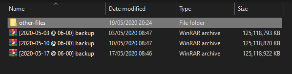

# simple-python-archiver
A quick and simple linux-python back up tool. This tool is intended to facilate regular backups of a list of files though the use of crontab. The script maintains a set of time-stamped archives with a regular structure. The user can either allow script to maintain a fixed number of archives, or simply fill the available space before the oldest archives are overwritten. 

# Features
- The list of files to be included are specified as absolute paths in "archive-files.txt"
- Each archive is placed in the "output" directory, with regular formatting, timestamped with your defined label.
- The script can either maintain a fixed number of archives, or maintain as many as drive space allows.
- Works happily with other files inside the same backup directory.
- Does not need super-user (depending on the files being included).

# An example of the regular output structure

 

I hope you find this useful!

If you have any questions, or improvements, please feel free to contact me at: douthwaiteja@gmail.com.
